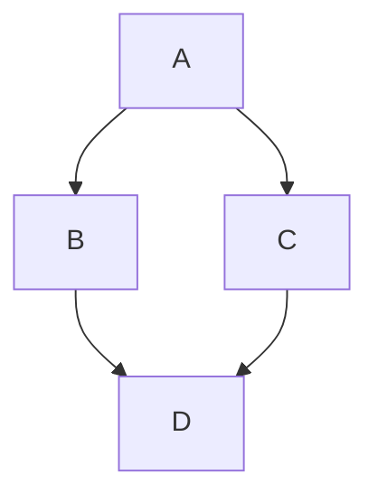
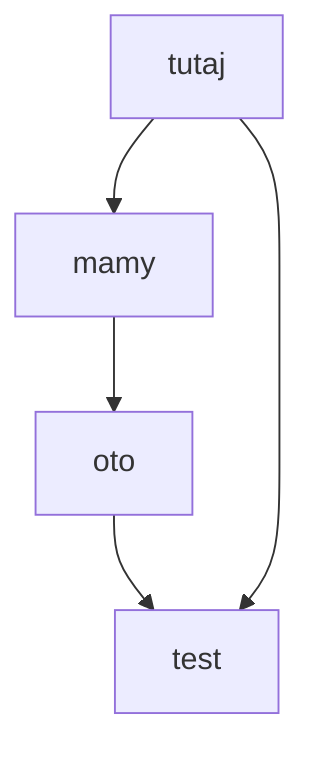

# projekt-zespolowy-2026





## Database Diagram

```mermaid
erDiagram
    ImageAnalysisRequest {
        UUID id PK
        string status
        datetime started_at
        datetime completed_at
        datetime created_at
        datetime updated_at
    }

    UploadedImage {
        int id PK
        UUID request_id FK
        string file
        string original_filename
        int file_size
        int width
        int height
        float latitude
        float longitude
        json exif_data
        datetime created_at
    }

    AnalysisResult {
        int id PK
        int image_id FK
        boolean is_deepfake
        float deepfake_score
        json forensics
        json geo_verification
        json objects_detected
        json alpr
        int processing_time_ms
        string error_message
        datetime created_at
    }

    ImageAnalysisRequest ||--o{ UploadedImage : contains
    UploadedImage ||--|| AnalysisResult : has
